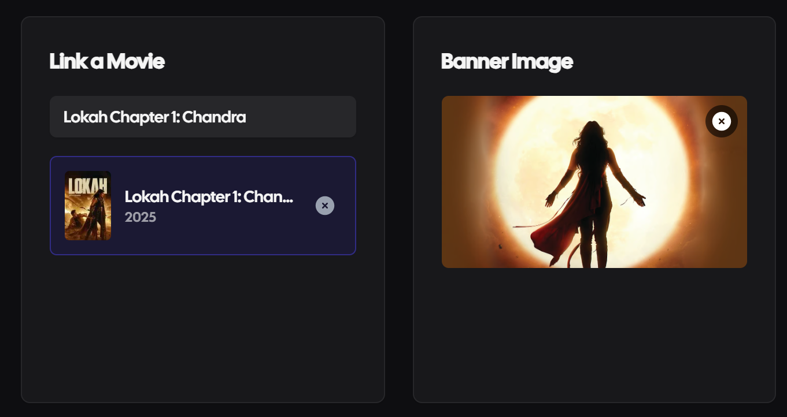

# DeeperWeave 🎬

<div align="center">


**The storytelling platform for the modern cinephile.**
*Combine the discovery of Letterboxd with the depth of Medium.*

[View Demo](https://deeperweave.vercel.app) · [Report Bug](https://github.com/rajavenkatesh04/deeperweave/issues)

<br/>


</div>

---

### 🚀 Overview
DeeperWeave is a social platform designed for in-depth cinema discussion. Unlike standard review sites that limit users to star ratings and short blurbs, DeeperWeave features a **custom-engineered block-based editor** allowing users to weave images, rich text, and movie metadata into compelling visual stories.

### ⚡ Key Engineering Features

#### 1. Custom WYSIWYG Editor Engine
Built on top of **TipTap**, I engineered a headless text editor that supports:
* **Slash Commands:** Notion-style menu for quick formatting (`/image`, `/heading`, `/quote`).
* **Media Drag & Drop:** Seamless image uploads directly into the document flow.
* **JSON Serialization:** Content is stored as structured JSON, not HTML, ensuring type safety and easy sanitization.

#### 2. Discovery & Data Aggregation
* **Dynamic Metadata Fetching:** Real-time integration with external Movie APIs to fetch cast, crew, and streaming availability.
* **Server-Side Filtering:** Advanced search and filtering logic executed on the server to minimize client-side processing.

#### 3. Social Graph Architecture
* **Relational Design:** Complex Many-to-Many relationships handling "Followers," "Watchlists," and "Likes" via Supabase (PostgreSQL).
* **Activity Feed:** Aggregated timeline showing friend activity, reviews, and trending lists.

---

### 📸 Interface Tour
*Visuals are optimized for compact viewing.*

| **The Editor** | **Discovery Feed** |
|:---:|:---:|
|  |  |
| *Notion-style block editor with media support* | *Real-time trending movies and shows* |

---

### 🛠️ Tech Stack & Decisions

| Component | Technology | Why this choice? |
| :--- | :--- | :--- |
| **Frontend** | **Next.js 14 (App Router)** | Leveraged React Server Components (RSC) to reduce bundle size by 40% for static movie pages. |
| **Database** | **Supabase (PostgreSQL)** | Chosen for its robust Row Level Security (RLS) and built-in Auth integration. |
| **Styling** | **Tailwind CSS** | Utility-first approach allowed for rapid UI iteration and consistent design system tokens. |
| **State** | **React Query + Zustand** | Managed server state (caching/revalidation) and local UI state (editor interactions) separately. |

---

### 💻 Local Development

**Prerequisites:** Node.js 18+

1.  **Clone the repository**
    ```bash
    git clone [https://github.com/rajavenkatesh04/deeperweave.git](https://github.com/rajavenkatesh04/deeperweave.git)
    cd deeperweave
    ```

2.  **Install dependencies**
    ```bash
    npm install
    # or
    pnpm install
    ```

3.  **Set up Environment Variables**
    Create a `.env.local` file:
    ```env
    NEXT_PUBLIC_SUPABASE_URL=your_project_url
    NEXT_PUBLIC_SUPABASE_ANON_KEY=your_anon_key
    TMDB_API_KEY=your_tmdb_key
    ```

4.  **Run the application**
    ```bash
    npm run dev
    ```

---

### 🤝 Contributing
Contributions are what make the open-source community such an amazing place to learn, inspire, and create. Any contributions you make are **greatly appreciated**.

**Core Maintainer:** [Raja Venkatesh](https://github.com/rajavenkatesh04)
